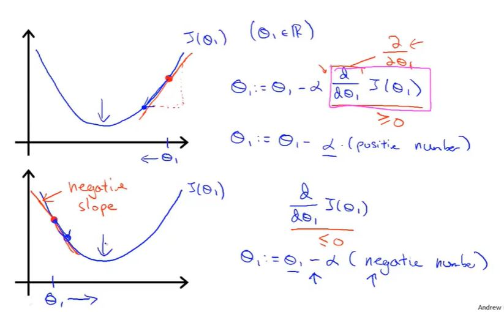
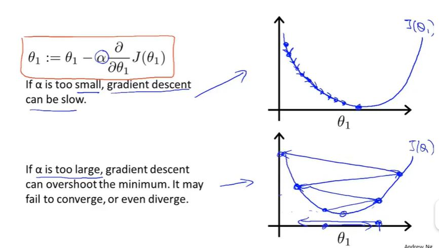

# 吴恩达机器学习笔记

## 监督学习

训练数据有明确标签

### 分类

- 回归问题（拟合）
- 分类问题（分块）

## 无监督学习

训练数据无明确标签

聚类算法（新闻分类）

- 管理计算机集群
- 社交网络分析
- 市场分割
- 天文数据分析

## 模型描述

`m:样本数量` `x:输入（特征）` `y:输出（预测目标变量）` `(x,y):一个训练样本` `(x^(i),y^(i)):第i个训练样本` `h:假设函数` 

单变量线性回归

## 代价函数

### 数学定义

`θi:模型参数` 

式1：

$$
min_{\theta_0\theta_1}{{1}\over{2m}}\displaystyle \sum^{m}_{i=1}{(h_0(x^i)-y^i)^2}
$$

令式2：

$$
J(\theta_0,\theta_1)={{1}\over{2m}}\displaystyle \sum^{m}_{i=1}{(h_0(x^i)-y^i)^2}
$$

则式1可写为

$$
min_{\theta_0\theta_1}J(\theta_0,\theta_1)
$$

$J(\theta_0,\theta_1)$即为代价函数（lost function）或平方误差函数

等高线图（右图）

## 梯度下降

### 数学定义

问题概述

$$
\theta_j:=\theta_j-\alpha{{\delta} \over{\delta\theta_j}}J(\theta_0,\theta_1)
$$

$$
(for j=0 and j=1)
$$

`:=为赋值符号，将后项值赋予前项` `α:学习速率，控制梯度下降速率` 

算法实现时需要同时更新θ0和θ1

### 导数项

θ1均为增大

### α

太小：会导致找到最低点经历步数过多

太大：会导致可能无法收敛甚至发散

梯度下降中会自动在接近最低点的地方减小学习速率的值
