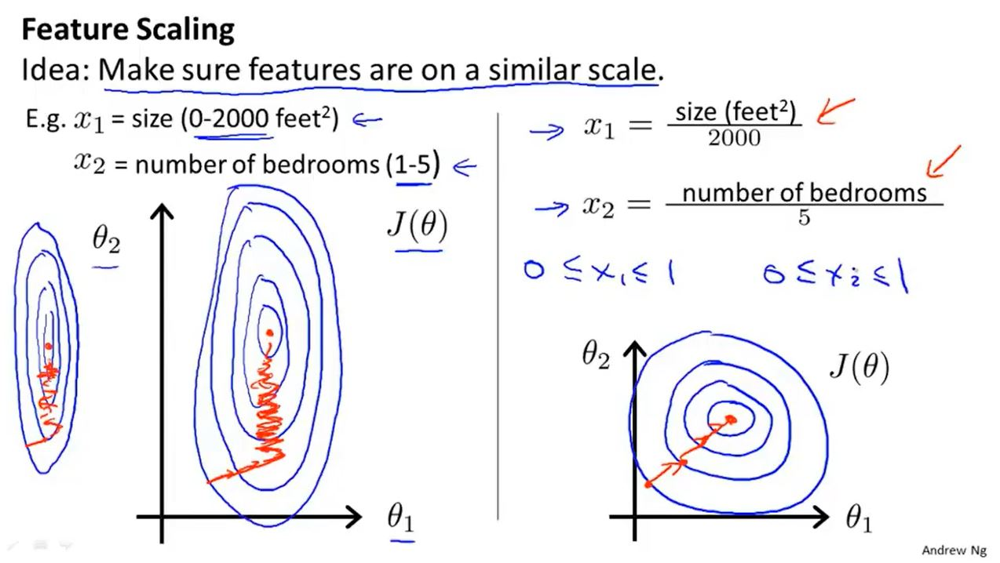

# Andrew Ng机器学习笔记

## 监督学习

训练数据有明确标签

### 分类

- 回归问题（拟合）
- 分类问题（分块）

## 无监督学习

训练数据无明确标签

聚类算法（新闻分类）

- 管理计算机集群
- 社交网络分析
- 市场分割
- 天文数据分析

## 模型描述

`m:样本数量` `x:输入（特征）` `y:输出（预测目标变量）` `(x,y):一个训练样本` `(x^(i),y^(i)):第i个训练样本` `h:假设函数` 

单变量线性回归

## 代价函数

### 数学定义


`θi:模型参数` 


式1：

$$
min_{\theta_0\theta_1}{{1}\over{2m}}\displaystyle \sum^{m}_{i=1}{(h_0(x^i)-y^i)^2}
$$

令式2：

$$
J(\theta_0,\theta_1)={{1}\over{2m}}\displaystyle \sum^{m}_{i=1}{(h_0(x^i)-y^i)^2}
$$

则式1可写为

$$
min_{\theta_0\theta_1}J(\theta_0,\theta_1)
$$

$J(\theta_0,\theta_1)$即为代价函数（lost function）或平方误差函数


等高线图（右图）

## 梯度下降

### 数学定义

问题概述


$$
\theta_j:=\theta_j-\alpha{{\delta} \over{\delta\theta_j}}J(\theta_0,\theta_1)
$$

$$
(for j=0 and j=1)
$$

`:=为赋值符号，将后项值赋予前项` `α:学习速率，控制梯度下降速率` 

算法实现时需要同时更新θ0和θ1

### 导数项


θ1均为增大

### α

太小：会导致找到最低点经历步数过多

太大：会导致可能无法收敛甚至发散


梯度下降中会自动在接近最低点的地方减小学习速率的值

### 线性回归的梯度下降

用梯度下降处理线性回归的代价函数


## 矩阵和向量

矩阵：由数字组成的矩形阵列。

向量：特殊的矩阵（只有一列）。

### 加法和标量乘法

矩阵加法：每个元素逐个相加。（只能维度相同的两个矩阵相加）

矩阵乘法：a行b列的矩阵A与b行n列的矩阵B相乘得到的矩阵X

- - X：a行n列，元素为A的第i行的各个元素和B的第i列的各个元素依次相乘再相加


[^预测房子的价格1]: 使用矩阵向量乘法使计算机更好的运算


[^预测房子的价格2]: 使用矩阵乘法使计算机更好的运算

### 矩阵乘法特征

有矩阵A和矩阵B

$A\times B \neq B\times A$ 

$(A\times B )\times C= B\times (A\times C)$ 

#### 单位矩阵

n x n矩阵，对角线元素是1，其余皆为0，记作$I_{n\times n}$

特性：对于任意的矩阵A

$A\cdot I = I\cdot A=A$ 

$A\times I = I\times A$

### 矩阵的逆和转置

#### 逆矩阵

只有m x m的矩阵（方阵 square matrix）才有逆矩阵

$A\times A^{-1} = A^{-1}\times A=I$

用pytorch求矩阵的逆：

```python
import torch

# matrix inverse
def invmat():
    arr1 = input('please input nine number to create 3 by 3 matrix\n'
                '(Use spaces between numbers and enter between lines):\n')
    arr2 = input()
    arr3 = input()
    line1 = [int(n) for n in arr1.split()]
    line2 = [int(n) for n in arr2.split()]
    line3 = [int(n) for n in arr3.split()]
    a = torch.tensor([[line1[0], line1[1], line1[2]],
                      [line2[0], line2[1], line2[2]],
                      [line3[0], line3[1], line3[2]]], dtype=float)
    print('a =', a)
    b = a.inverse()
    print('a\'s inverse matrix is:\n', b)
if __name__ == '__main__':
    print('matrix inverse')
    invmat()
```

结果：

```python
matrix inverse
please input nine number to create 3 by 3 matrix
(Use spaces between numbers and enter between lines):
0 1 2
1 1 4
2 -1 0
a = tensor([[ 0.,  1.,  2.],
        [ 1.,  1.,  4.],
        [ 2., -1.,  0.]], dtype=torch.float64)
a's inverse matrix is:
 tensor([[ 2.0000, -1.0000,  1.0000],
        [ 4.0000, -2.0000,  1.0000],
        [-1.5000,  1.0000, -0.5000]], dtype=torch.float64)

Process finished with exit code 0
```

#### 转置矩阵

```python
import torch

# matrix transpose
def tmatrix():
    a = torch.rand(2,4)
    print('a =', a)
    b = torch.t(a)
    print('a\'s transpose matrix is\n', b)

if __name__ == '__main__':
    print('matrix transpose')
    tmatrix()
```

结果：

```python
matrix transpose
a = tensor([[0.0471, 0.2030, 0.4294, 0.2553],
        [0.0069, 0.1753, 0.1336, 0.5577]])
a's transpose matrix is
 tensor([[0.0471, 0.0069],
        [0.2030, 0.1753],
        [0.4294, 0.1336],
        [0.2553, 0.5577]])

Process finished with exit code 0
```

## 多元线性回归的多特征

### 多元线性回归的假设形式


### 多元梯度下降法


### 演练

#### 特征缩放




其中，S1为方差或者最大值减最小值，μ1为X1的平均值
